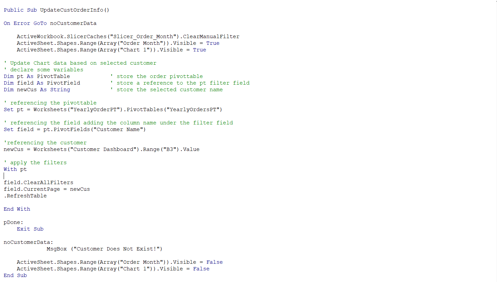

# MS_Excel_Data_Analysis_Dashboard_Reporting

## Purpose

The purpose of this project is to perform data cleaning and creating a user-friendly interactive dashboard with customer order details using various MS Excel features including Macros & VBA. The final dashboard can be downloaded from this [link](https://github.com/Sukanya807/MS_Excel_Data_Analysis_Dashboard_Reporting/blob/main/CustomerOrders-02_worksheet.xltm)

## Data Source

 [Microsoft Excel Data Analysis & Dashboard Reporting Course UDEMY](https://amdlearning.udemy.com/course/microsoft-excel-data-analysis-and-dashboard-reporting/learn/lecture/8353328#overview)
 
 ## Tools Used
  - MS Excel

## Excel Features Used

### Data Cleaning

- Use PROPER() on Contact Name column.
- Use UPPER() on Customer ID column.
- Use CHOOSE() on ShipVIA column to replace numbers with meaningful names.
- Use TEXT() function on Order Date to extract Order Month

### Dashboard - Customer Info

- Data Validation
- VLOOKUP
- IF statement with Nested VLOOKUP
- Index & Match

### Dashboard - Order History

- Advanced Filter
- Recording Macro

### Dashboard - Order Details

- Use SUBTOTAL() function to filtered data

### Dashboard - Charts

- Pivot Tables
- Tie pivot chart to dashboard page using VBA

- Insert Slicer

## Summary

The final dashboard is user-friendly and interactive. When the user selects a customer from the dropdown menu, their contact details, order history, order details and a chart depicting their yearly order amounts are automatically updated. This interactive dashboard can be a useful tool for analyzing customer data.
